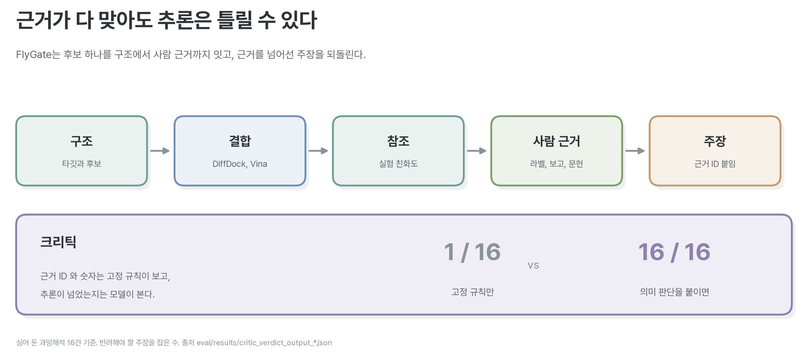
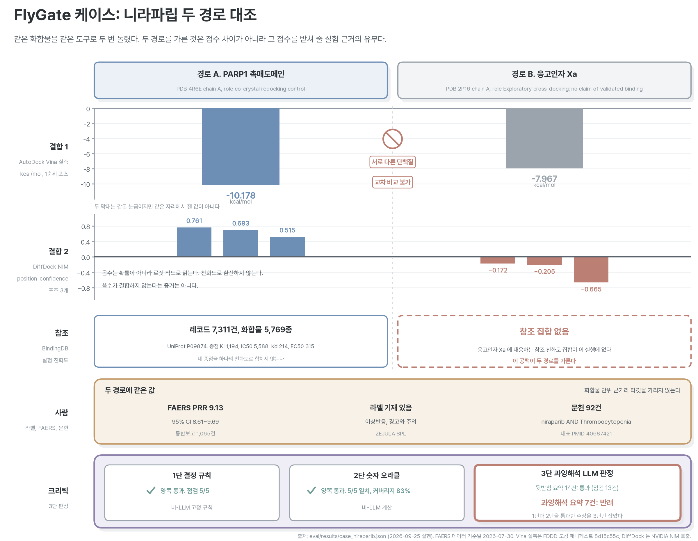
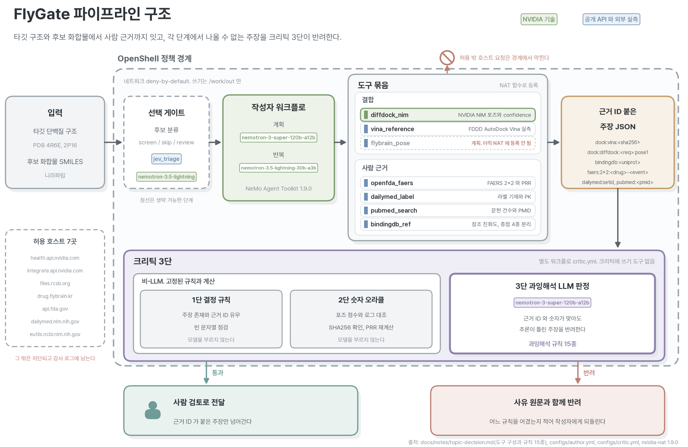

# FlyGate

**도킹 점수에서 나올 수 없는 주장을 잡는 신약 후보 검증 에이전트**

NVIDIA x 패스트캠퍼스 Korea Agentic AI Hackathon 2026 온라인 사전 챌린지 제출 프로젝트.

후보물질 하나를 구조에서 사람까지 이어 검증한다. 타깃 단백질과 후보를 받아 결합을 보고,
실험 친화도를 참조하고, 그 후보가 사람에게서 어땠는지를 허가 라벨과 이상사례 보고와 문헌으로
확인한다. 모든 주장에 근거 ID가 붙고, **도구 문서가 금지한 추론을 한 주장은 크리틱이 반려한다.**



## 형식 검사의 한계

도킹 점수에는 도구 문서가 직접 밝힌 해석 한계가 있다. 서로 다른 단백질에서 나온 점수는 견줄 수
없고, 딥러닝 도킹이 내는 신뢰도 값은 결합 세기가 아니며, 교차 도킹 결과는 결합의 증거가 아니다.

LLM 에이전트를 이런 도구에 붙이면 그 선을 자주 넘는다. **근거도 제대로 붙고 숫자도 로그와
맞는데 결론만 틀린 요약이 나온다.** 형식을 보는 검사로는 걸러 낼 수 없다.

규제도 같은 문제를 보고 있다. FDA와 EMA는 2026년 1월 14일에 의약품 전 주기의 AI 활용 원칙
열 가지를 공동으로 냈고 안전성 모니터링이 그 범위에 들어간다. 그러면 모델이 낸 판단을
무엇으로 뒷받침할 것인지를 답해야 한다.

## 크리틱 3단

| 단 | 무엇을 보는가 | 모델을 쓰는가 |
|---|---|---|
| 1단 결정 규칙 | 주장 존재, 근거 ID 유무, 빈 문자열 | 쓰지 않는다 |
| 2단 숫자 오라클 | 점수가 원본 로그와 맞는지, SHA256 대조, 지표 재계산 | 쓰지 않는다 |
| 3단 과잉해석 판정 | 근거와 숫자가 맞아도 추론이 한계를 넘었는지 | **여기서만 쓴다** |

규칙 열다섯 가지는 **도구 제공자와 데이터 제공자가 문서에 적은 경고**에서 그대로 옮겼다.
열세 가지가 결합 근거를, 두 가지가 사람 근거를 다루므로 결합 쪽 검증이 더 두텁다.
출처는 FDDD 데모의 `notes` 배열, NVIDIA DiffDock 문서, 기존 약물감시 규율 셋이다.

한 가지는 직접 재서 넣었다. DiffDock 호스팅 API에는 시드가 없어, 같은 수용체와 리간드로
두 번 부르자 3순위 포즈 신뢰도가 0.725와 0.515로 갈렸다.

## 검증된 수치

모두 실행 결과에서 가져왔다.

| 항목 | 값 | 어디서 |
|---|---|---|
| 오프라인 테스트 | 293개 통과 | `pytest -q -m "not network"` |
| NAT 등록 도구 | 8종 | `configs/author.yml` |
| 에이전트 도구 호출 | 4종 연속, 주장 4건 전부 근거 있음 | `eval/results/nat_run_author_flydock.json` |
| 과잉해석 규칙 | 15종 | `src/harness/tools/overclaim_rules.py` |
| 평가 케이스 | 33건 | `eval/cases.jsonl` |
| **적발률 (LLM 포함)** | **16/16**, 거짓 양성 0/17 | `eval/results/critic_verdict_output_llm.json` |
| **적발률 (결정 규칙만)** | **1/16** | `eval/results/critic_verdict_output_deterministic.json` |
| DiffDock NIM 호출 | HTTP 200, 4.1초, 포즈 3개 | `eval/results/diffdock_smoke.txt` |
| 샌드박스 스모크 | 18건 통과 | `eval/results/openshell_smoke_flydock.txt` |
| 3단 판정 비용 | 건당 출력 토큰 270개, 지연 중앙값 2,243ms | `eval/results/bench_nemotron-super-run2.json` |

**두 적발률을 나란히 놓아야 크리틱이 하는 일이 드러난다.** 심어 둔 과잉해석 열여섯 건을
LLM 판정은 전부 반려하고 고정 규칙만으로는 한 건만 걸러 낸다. 나머지 열다섯 건은 근거 ID와
숫자가 모두 맞아 형식 검사를 통과한다.

## 케이스: 같은 화합물, 두 경로



니라파립을 두 타깃에 돌렸다. 점수 차이는 2.2 kcal/mol이다.

| | 경로 A (PARP1 4R6E) | 경로 B (응고인자 Xa 2P16) |
|---|---|---|
| AutoDock Vina | -10.178 | -7.967 |
| DiffDock 신뢰도 | 0.761, 0.693, 0.515 | -0.172, -0.205, -0.665 |
| BindingDB 참조 | 레코드 7,311건 | **없음** |
| 사람 근거 | 라벨 기재, PRR 9.13, 문헌 92건 | 화합물 단위라 타깃을 가리지 못함 |

**경로 A에만 실험 근거가 붙는다.** 점수 차이보다 이쪽이 판단을 갈랐다.
전체 브리프는 `eval/results/case_niraparib_brief.md`에 있고 "근거 안의 진술" 여덟 항목과
"근거 밖의 진술" 열한 항목으로 끝난다.

## 쓴 기술



**NVIDIA**

- Nemotron 3 Super 120B (계획과 크리틱 판정), Nemotron 3.5 Lightning 30B (반복 작업)
- DiffDock NIM (`health.api.nvidia.com/v1/biology/mit/diffdock`)
- NeMo Agent Toolkit 1.9.0 (작성자와 크리틱 워크플로 분리, `nat eval`, Guardrails 미들웨어)
- OpenShell 0.0.116 (deny-by-default 정책, 허용 호스트 일곱 곳)
- build.nvidia.com 스킬 카탈로그 (BioNeMo 에이전트 스킬 문서를 NIM 호출 규격 참조로 사용)

**그 밖에** Python 3.12, AutoDock Vina 실측(FDDD), openFDA FAERS, DailyMed SPL,
PubMed E-utilities, RCSB PDB, BindingDB 참조.

불균형 지표(PRR, ROR, 신뢰구간, 카이제곱)는 파이썬이 계산하고 모델은 손대지 않는다.

## 시작

```bash
git clone https://github.com/kakyungkim/korea-agentic-hackathon-2026
cd korea-agentic-hackathon-2026
python3.12 -m venv .venv
.venv/bin/pip install -r requirements.txt
.venv/bin/pip install -e . --no-deps
cp .env.example .env            # NVIDIA_API_KEY 를 채운다. .env 는 커밋되지 않는다

.venv/bin/python -m pytest -q -m "not network"        # 오프라인 테스트
.venv/bin/nat validate --config_file configs/author.yml
```

케이스 시연을 돌려 본다. `--offline` 을 붙이면 캐시만으로 돌아 네트워크를 타지 않는다.

```bash
set -a; source .env; set +a
.venv/bin/python scripts/run_case_demo.py --out eval/results
cat eval/results/case_niraparib_brief.md
```

문서에 적힌 수치가 출처와 같은지 대조한다. 어긋난 항목 수가 종료 코드로 나온다.

```bash
.venv/bin/python scripts/verify_numbers.py
```

적발률을 잰다. **두 수치를 함께 봐야 한다.**

```bash
.venv/bin/nat eval --config_file configs/eval.yml
CRITIC_DETERMINISTIC_ONLY=true .venv/bin/nat eval --config_file configs/eval.yml
```

판정기를 바꿔 가며 같은 조건으로 재려면 아래를 쓴다. 지연과 토큰까지 기록한다.

```bash
.venv/bin/python scripts/bench_critic_judge.py --label nemotron-super
.venv/bin/python scripts/bench_critic_judge.py --compare eval/results/bench_*.json
```

자세한 것은 `docs/ONBOARDING.md` 하나면 된다. 막히면 `docs/TROUBLESHOOTING.md` 를 먼저 본다.
겪고 푼 문제 열 건을 적어 두었다.

## 미시행 사항

| 항목 | 실제 상태 |
|---|---|
| `flybrain_pose` | 계획. 초파리 커넥톰 포즈 탐색은 아직 도구로 등록하지 않았다 |
| `jev_triage` | 계획. 판정 전용 모델을 싼 분류기로 앞에 두는 구성이다. 호출 규격이 `state` 와 `questions` 형태라 어댑터가 필요하다 |
| NemoGuard 판정 모델 | 배선까지 했다. 호스팅 쪽 오류로 시연하지 못했다 |
| 샌드박스 안 DiffDock 호출 | TLS가 닿는 것까지 확인했다. POST는 부르지 않았다 |
| NeMo Retriever 리랭커 | 이 계정 모델 목록 여든두 개에 없어 쓰지 않았다 |
| NemoClaw | 쓰지 않았다. 참조 스택으로 검토만 했다 |

평가 케이스의 정답 라벨은 직접 붙였고 도메인 전문가 두 명 이상의 일치도는 아직 재지 않았다.
`build.nvidia.com` 이 간헐적으로 503을 내므로 측정을 다시 돌려야 할 때가 있다.

## 계보와 기여

이 저장소는 2026-08 Agent Forge AI Hackathon Seoul에 낸
[PharmaSignal v0](https://github.com/kakyungkim/pharmasignal-v0)의 후속이다.
v0에서 문제 정의와 검증 설계를 물려받았고, v0이 쓴 외부 플랫폼은 이번에 하나도 쓰지 않았다.
측정을 먼저 하고 서술한다는 원칙도 그때부터 이어 온다.

주제와 초파리 도킹 경로는 팀원 제안이고, 에이전트 하네스와 검증 체계는 선행 프로젝트에서
이어 온 자산이다. 두 갈래를 하나의 파이프라인으로 이었다. 갈래별 구분은 `docs/notes/credits.md`.

초파리 도킹 자산 [FDDD](https://drug.flybrain.kr)는 팀원의 별도 저작물이다.
**복제하지 않고 도구로 참조한다.** 데이터 출처와 SHA256을 그대로 인용한다.

## 외부 자산과 라이선스

| 자산 | 출처 | 라이선스 |
|---|---|---|
| 초파리 도킹 데모 FDDD | [drug.flybrain.kr](https://drug.flybrain.kr) | 팀원 저작물. 복제하지 않고 참조 |
| AutoDock Vina 실측과 준비된 수용체 | Durrant Lab webina, MolModa | 각 저장소 표기 |
| 수용체 구조 4R6E, 2P16, 3LN1 | RCSB PDB | 공개 |
| BindingDB 참조 친화도 | BindingDB REST (FDDD 캡처 경유) | 각 사이트 표기 |
| NVIDIA BioNeMo 에이전트 스킬 문서 | NVIDIA-BioNeMo/bionemo-agent-toolkit | 문서 CC BY 4.0, 코드 Apache-2.0 |
| 초파리 커넥톰 | MaleCNS (Janelia) | **CC BY 4.0. 출처 표기 필요** |
| Pretendard 폰트 | orioncactus/pretendard | OFL |

## 문서

| 문서 | 무엇 |
|---|---|
| `docs/notes/topic-decision.md` | 주제 결정 근거, 과잉해석 규칙 15종, 게이트와 일정 |
| `docs/notes/bionemo-nim.md` | NVIDIA 생물학 NIM 접근 확인과 호출 규격, 구현 함정 |
| `docs/notes/fddd-and-jev.md` | 초파리 데모와 Jev 실측 확인 |
| `docs/notes/fddd-teardown.md` | 초파리 데모 기술 분해 |
| `docs/notes/real-world-cases.md` | 현장에서 실제로 일어난 과잉해석 사례와 확인 결과 |
| `docs/notes/jev-primer.md` | 판정 전용 모델 Jev 정리. 자체 측정과 독립 검증을 나눠 적음 |
| `docs/notes/paper-plan.md` | 논문 계획, 선행연구와 정직한 한계 |
| `docs/COURSE-GUIDE.md` | NVIDIA DLI 강좌 수강 안내 |
| `docs/TROUBLESHOOTING.md` | 겪고 푼 문제 열 건 |
| `docs/HANDOFF.md` | 진행 상황과 검증된 수치 |
