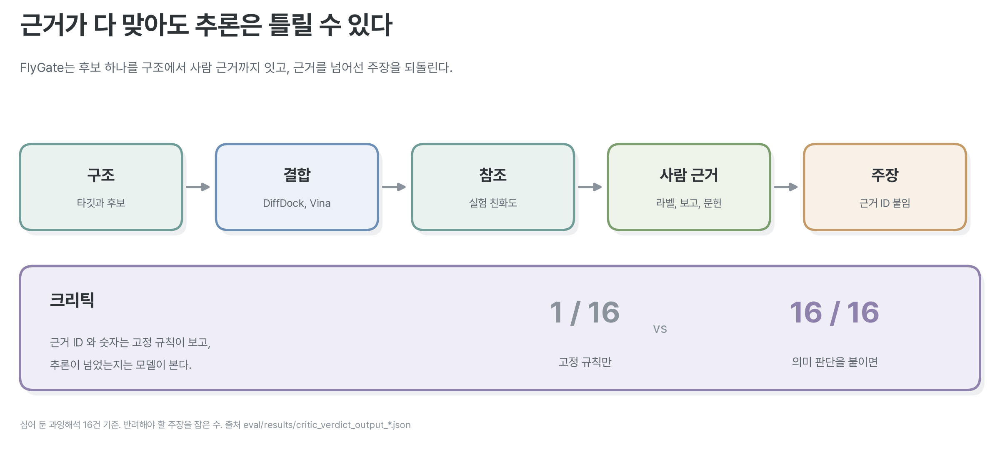
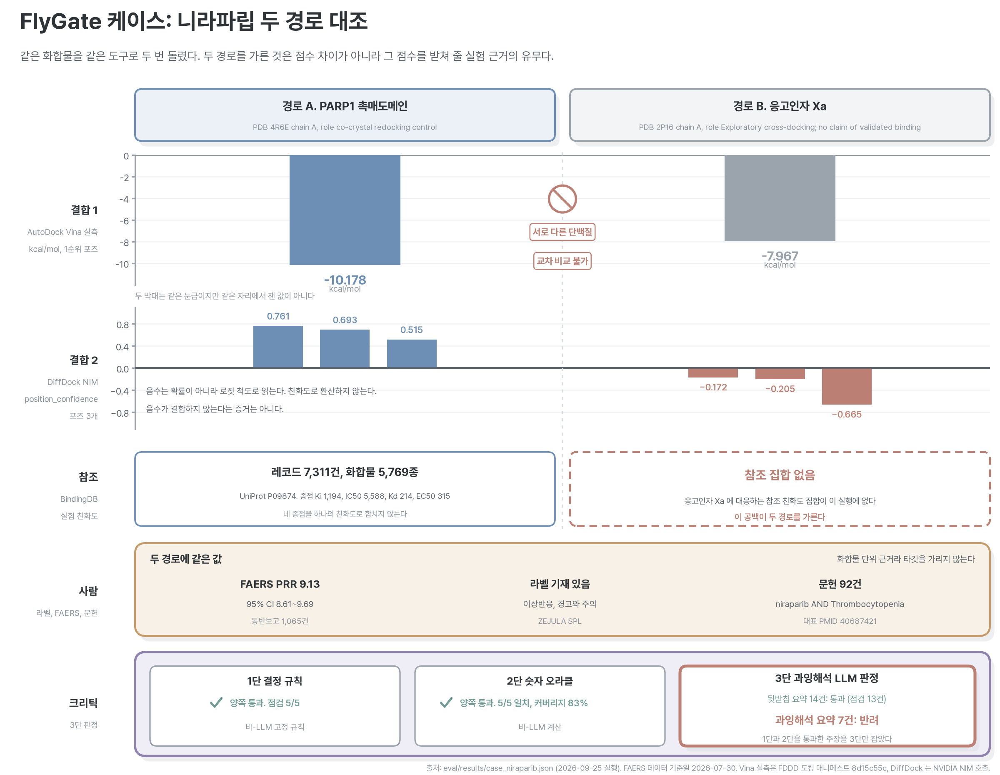
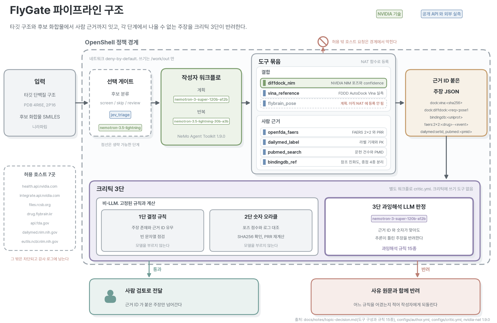

# FlyGate

**근거를 인용한 주장이 그 근거를 넘어섰는지 가려내는 신약 후보 검증 에이전트**

NVIDIA x 패스트캠퍼스 Korea Agentic AI Hackathon 2026 온라인 사전 챌린지 제출 프로젝트.

후보물질 하나를 구조에서 사람까지 이어 검증한다. 타깃 단백질과 후보를 받아 결합을 보고,
실험 친화도를 참조하고, 그 후보가 사람에게서 어땠는지를 허가 라벨과 이상사례 보고와 문헌으로
확인한다. 모든 주장에 근거 ID가 붙고, **도구 문서가 금지한 추론을 한 주장은 크리틱이 반려한다.**



## 팀 데모와 저장소 두 곳

팀이 만든 데모는 **<https://project-flygate.vercel.app>** 이고 저장소는
**<https://github.com/Team-FlyGate/Project-FlyGate>** 이다. 구성은 FlyGate 아래
FlyDiscovery(신약개발)와 FlyVigilance(약물감시) 둘이고, 웹과 api, FAERS 창고 파이프라인,
벤치마크, 에이전트 스킬이 들어 있다.

이 저장소는 그 데모가 쓰는 **규칙 원본과 측정 스크립트**다. NAT 도구 등록, OpenShell 정책,
과잉해석 규칙 17종, 평가 케이스, 근거 등급 시제품이 여기 있다. 두 저장소를 합치지 않고
양쪽에서 서로를 가리킨다. 검토 기록은 `docs/notes/06-project/flyvigilante-review-2026-09-28.md`에 있다.
데모 저장소는 9월 28일에 `FlyVigilante`, `FlyVigilance`를 거쳐 `Project-FlyGate`로 정리됐다.

## 형식 검사의 한계

안전성 검토자가 감당할 양이 사람 수를 넘었다. FDA 이상사례 보고만 2천만 건이 넘고, 그 가운데
어느 것이 약 때문인지 가리는 인과성 평가가 가장 오래 걸린다. 그래서 AI로 덜어 내려는 시도가
이어지는데, 모델이 내놓은 판단을 무엇과 대조해 믿을지가 비어 있다.

사람 판정을 정답으로 쓰기 어렵다. 같은 사례를 두 척도로 평가한 연구에서 일치도가 카파 0.22에
그쳤다. 대신 쓸 수 있는 것이 **도구와 데이터 제공자가 문서에 적어 둔 한계**다. 서로 다른
단백질에서 나온 도킹 점수는 견줄 수 없고, 딥러닝 도킹이 내는 신뢰도 값은 결합 세기가 아니며,
교차 도킹 결과는 결합의 증거가 아니다. 만든 쪽이 밝힌 것이므로 취향 문제가 되지 않는다.

LLM 에이전트를 이런 도구에 붙이면 그 선을 자주 넘어, 근거도 제대로 붙고 숫자도 로그와
맞는데 결론만 틀린 요약이 나온다. 형식을 보는 검사로는 걸러지지 않는다.

FDA와 EMA는 2026년 1월 14일에 의약품 전 주기의 AI 활용 원칙 열 가지를 공동으로 냈고
안전성 모니터링이 그 범위에 들어간다. 모델이 낸 판단을 무엇으로 뒷받침할지가 남는다.

## 크리틱 3단

| 단 | 무엇을 보는가 | 모델을 쓰는가 |
|---|---|---|
| 1단 결정 규칙 | 주장 존재, 근거 ID 유무, 빈 문자열 | 쓰지 않는다 |
| 2단 숫자 오라클 | 점수가 원본 로그와 맞는지, SHA256 대조, 지표 재계산 | 쓰지 않는다 |
| 3단 과잉해석 판정 | 근거와 숫자가 맞아도 추론이 한계를 넘었는지 | **여기서만 쓴다** |

규칙 열다섯 가지는 **도구 제공자와 데이터 제공자가 문서에 적은 경고**에서 그대로 옮겼다.
열세 가지가 결합 근거를, 두 가지가 사람 근거를 다루므로 결합 쪽 검증이 더 두텁다.
출처는 FDDD 데모의 `notes` 배열, NVIDIA DiffDock 문서, 기존 약물감시 규율 셋이다.

한 가지는 직접 쟀다. DiffDock 호스팅 API에 시드가 없어 같은 수용체와 리간드로 두 번 부르자
3순위 포즈 신뢰도가 0.725와 0.515로 갈렸다.

## 검증된 수치

모두 실행 결과에서 가져왔다.

| 항목 | 값 | 어디서 |
|---|---|---|
| 오프라인 테스트 | 302개 통과 | `pytest -q -m "not network"` |
| NAT 등록 도구 | 8종 | `configs/author.yml` |
| 에이전트 도구 호출 | 4종 연속, 주장 4건 전부 근거 있음 | `eval/results/nat_run_author_flydock.json` |
| 과잉해석 규칙 | 15종 | `src/harness/tools/overclaim_rules.py` |
| 평가 케이스 | 33건 | `eval/cases.jsonl` |
| 적발률 (고정 규칙만) | 1/16 | `eval/results/critic_verdict_output_deterministic.json` |
| 적발률 (규칙 없이 모델 판단만) | 13/16, 거짓 양성 1/17 | `eval/results/bench_generic-arm.json` |
| **적발률 (규칙 15종 + 모델)** | **16/16**, 거짓 양성 0/17 | `eval/results/critic_verdict_output_llm.json` |
| 표기 변동 판정 뒤집힘 | 0/126 (상품명, 코드명 각 3회) | `eval/results/notation_robustness_2026-09-27.json` |
| DiffDock NIM 호출 | HTTP 200, 4.1초, 포즈 3개 | `eval/results/diffdock_smoke.txt` |
| 샌드박스 스모크 | 18건 통과 | `eval/results/openshell_smoke_flydock.txt` |
| 3단 판정 비용 | 건당 출력 토큰 270개, 지연 중앙값 2,243ms | `eval/results/bench_nemotron-super-run2.json` |

심어 둔 과잉해석 열여섯 건을 LLM 판정은 전부 반려하고 고정 규칙만으로는 한 건만 걸러 낸다.
나머지 열다섯 건은 근거 ID와 숫자가 모두 맞아 형식 검사를 통과한다.

## 케이스: 같은 화합물, 두 경로



니라파립을 두 타깃에 돌렸다. 점수 차이는 2.2 kcal/mol이다.

| | 경로 A (PARP1 4R6E) | 경로 B (응고인자 Xa 2P16) |
|---|---|---|
| AutoDock Vina | -10.178 | -7.967 |
| DiffDock 신뢰도 | 0.761, 0.693, 0.515 | -0.172, -0.205, -0.665 |
| BindingDB 참조 | 레코드 7,311건 | **없음** |
| 사람 근거 | 라벨 기재, PRR 9.13, 문헌 92건 | 화합물 단위라 타깃을 가리지 못함 |

경로 A에만 실험 근거가 붙는다. 점수 차이보다 이쪽이 판단을 갈랐다.
전체 브리프는 `eval/results/case_niraparib_brief.md`에 있고 "근거 안의 진술" 여덟 항목과
"근거 밖의 진술" 열한 항목으로 끝난다.

## 쓴 기술



**NVIDIA**

- Nemotron 3 Super 120B (계획과 크리틱 판정), Nemotron 3.5 Lightning 30B (반복 작업)
- DiffDock NIM (`health.api.nvidia.com/v1/biology/mit/diffdock`)
- NeMo Agent Toolkit 1.9.0 (작성자와 크리틱 워크플로 분리, `nat eval`, Guardrails 미들웨어)
- OpenShell 0.0.116 (deny-by-default 정책, 허용 호스트 일곱 곳)
- build.nvidia.com 스킬 카탈로그. BioNeMo 에이전트 스킬 `diffdock-nim` 을 `.claude/skills/nvidia-diffdock-nim/` 에 설치해 쓴다

**그 밖에** Python 3.12, AutoDock Vina 실측(FDDD), openFDA FAERS, DailyMed SPL,
PubMed E-utilities, RCSB PDB, BindingDB 참조.

불균형 지표(PRR, ROR, 신뢰구간, 카이제곱)는 파이썬이 계산하고 모델은 손대지 않는다.

## 시작

```bash
git clone https://github.com/kakyungkim/korea-agentic-hackathon-2026
cd korea-agentic-hackathon-2026
python3.12 -m venv .venv
.venv/bin/pip install -r requirements.txt
.venv/bin/pip install -e . --no-deps
cp .env.example .env            # NVIDIA_API_KEY 를 채운다. .env 는 커밋되지 않는다

.venv/bin/python -m pytest -q -m "not network"        # 오프라인 테스트
.venv/bin/nat validate --config_file configs/author.yml
```

케이스 시연을 돌려 본다. `--offline` 을 붙이면 캐시만으로 돌아 네트워크를 타지 않는다.

```bash
set -a; source .env; set +a
.venv/bin/python scripts/run_case_demo.py --out eval/results
cat eval/results/case_niraparib_brief.md
```

문서에 적힌 수치가 출처와 같은지 대조한다. 어긋난 항목 수가 종료 코드로 나온다.

```bash
.venv/bin/python scripts/verify_numbers.py
```

적발률을 잰다. **두 수치를 함께 봐야 한다.**

```bash
.venv/bin/nat eval --config_file configs/eval.yml
CRITIC_DETERMINISTIC_ONLY=true .venv/bin/nat eval --config_file configs/eval.yml
```

판정기를 바꿔 가며 같은 조건으로 재려면 아래를 쓴다. 지연과 토큰까지 기록한다.

```bash
.venv/bin/python scripts/bench_critic_judge.py --label nemotron-super
.venv/bin/python scripts/bench_critic_judge.py --compare eval/results/bench_*.json
```

자세한 것은 `docs/ONBOARDING.md` 하나면 된다. 막히면 `docs/TROUBLESHOOTING.md` 를 먼저 본다.
겪고 푼 문제 열 건을 적어 두었다.

## 미시행 사항

| 항목 | 실제 상태 |
|---|---|
| `flybrain_pose` | 계획. 초파리 커넥톰 포즈 탐색은 아직 도구로 등록하지 않았다 |
| `jev_triage` | 계획. 판정 전용 모델을 싼 분류기로 앞에 두는 구성이다. 호출 규격이 `state` 와 `questions` 형태라 어댑터가 필요하다 |
| NemoGuard 판정 모델 | 배선까지 했다. 호스팅 쪽 오류로 시연하지 못했다 |
| 샌드박스 안 DiffDock 호출 | TLS가 닿는 것까지 확인했다. POST는 부르지 않았다 |
| NeMo Retriever 리랭커 | 이 계정 모델 목록 여든두 개에 없어 쓰지 않았다 |
| NemoClaw | 쓰지 않았다. 참조 스택으로 검토만 했다 |


평가 케이스의 정답 라벨은 직접 붙였고 도메인 전문가 두 명 이상의 일치도는 아직 재지 않았다.
약물 이름 표기만 바꿔도 LLM 판단이 흔들린다는 보고가 있어(Gallifant 등, JCO Clin Cancer
Inform 2025;9:e2400257) 우리 3단도 같은 사정거리 안에 있다. 상품명 Zejula 와 개발 코드명
MK-4827 로 바꿔 각각 3회 재실행했고 판정 126건에서 뒤집힘이 없었다. 다만 화합물 하나에
케이스 14건이라 **0/126 의 95퍼센트 단측 상한이 2.35퍼센트**다. 판정 1건당 그 수준의 민감도는
이 표본으로 배제되지 않는다.
`build.nvidia.com` 이 간헐적으로 503을 내므로 측정을 다시 돌려야 할 때가 있다.

## 선행 연구와 우리가 더한 것

에이전트로 약물안전 요약을 만들고 결정적으로 재실행하는 구성은 이미 발표되어 있다.
Calle 등이 FAERS와 정리된 CYP 매핑과 PubMed를 ReAct 에이전트로 묶어 약물 110종의 요약을
생성하고, 디코딩 온도를 0으로 고정하고 도구 입출력과 버전을 기록해 감사와 정확한 재실행이
가능하게 했다(Stud Health Technol Inform 2026;336:42-46).

그 연구는 계산된 표에서만 문장을 만들게 해 생성 시점에 제약을 걸었고, 생성물의 의미
충실성은 저자들이 두 약물 사례를 읽어 정성으로 확인했다("assessed qualitatively"). 적발률에
해당하는 수치가 없고 부정 사례도 없다.

우리는 생성한 뒤를 검사한다.

| | Calle 2026 | FlyGate |
|---|---|---|
| 제한을 거는 시점 | 생성할 때 | 생성한 뒤 |
| 제한의 출처 | 저자의 약동학 지식 | 도구와 데이터 제공자 문서의 경고 15종 |
| 검증 주체 | 저자가 읽고 판단 | 별도 크리틱 워크플로. 쓰기 도구 없음 |
| 성능 수치 | 없음 | 1/16 → 13/16 → 16/16, 거짓 양성 0/17 |
| 부정 사례 | 없음 | 심어 둔 과잉해석 16건 |

로깅 범위는 저쪽이 넓다. 도구 입출력 전체를 남기는데 우리는 결합 근거만 해시로 고정하고
사람 근거 네 단계는 조회 시각과 질의 URL로 되짚는다.

### 규칙이 없으면 어떻게 되는가

3단 프롬프트에서 규칙 목록만 빼고 나머지를 같게 둔 조건을 같은 케이스에 돌렸다.

| 조건 | 적발률 | 거짓 양성 |
|---|---|---|
| 고정 규칙만, 모델 없음 | 1/16 | |
| 규칙 없이 LLM 일반 판정 | 13/16 | 1/17 |
| 규칙 15종 + LLM | 16/16 | 0/17 |

LLM 판단만으로도 열세 건이 걸러진다. 규칙이 더한 것은 세 건과 거짓 양성 하나다.

놓친 세 건이 무엇인지가 규칙의 값을 보여 준다. 단일 시드 결과에 재현성을 주장하는 것,
SMILES를 실행 입력이라고 말하는 것, DiffDock 호스팅 API에 시드가 없다는 사실이다.
분야 상식으로는 닿지 않고 도구 문서를 읽어야 안다. 측정은 `docs/notes/03-structure/rule-contribution-2026-09-27.md`.

규칙을 늘리면 늘 좋아지는지도 재 보았다. 구조 예측 도구를 붙이는 안이 나와 예측 구조와 신뢰도
지표(pLDDT, pTM, ipTM)를 다루는 규칙 2종을 NVIDIA 스킬 문서에서 옮겨 적고, 케이스 5건에
두 프롬프트로 물었다. **기존 15종만으로도 반려 정답 4건을 모두 잡아 새 규칙이 추가로 잡은 것은
없었다.** 그래서 두 규칙은 `overclaim_rules.STRUCTURE_RULES` 로 분리해 두고 발표하는 적발률은
15종 기준을 그대로 쓴다. 측정은 `docs/notes/03-structure/structure-rules-2026-09-27.md`.

### 예상 질문

**프롬프트로 주의를 주면 되지 않는가.** 실측에서 듣지 않았다. Rao 등이 LiverTox를 참조하라는
프롬프트만 준 조건과 아무 제약 없는 조건을 견주었는데 정확성(p = 0.103), 완전성(p = 0.514),
간결성(p = 0.865) 어디에서도 차이가 없었다(Hepatol Commun 2026;10:e0895).

**LLM 판정을 믿을 수 있는가.** Wu 등이 의학 응답의 진술과 출처를 짝지어 지지 여부를 판정하는
파이프라인을 만들고, 그 판정이 미국 면허 의사 3인 합의와 89퍼센트 일치하며 의사들끼리의 어느
두 명 사이 일치도보다 높다는 것을 보였다(Nat Commun 2025;16:3615). 다만 그쪽이 묻는 것은
출처가 진술을 지지하는지이고, 우리는 주장이 근거로 말할 수 있는 범위를 넘었는지를 묻는다.

## 계보와 기여

이 저장소는 2026-08 Agent Forge AI Hackathon Seoul에 낸
[PharmaSignal v0](https://github.com/kakyungkim/pharmasignal-v0)의 후속이다.
v0에서 문제 정의와 검증 설계를 물려받았고, v0이 쓴 외부 플랫폼은 이번에 하나도 쓰지 않았다.
측정을 먼저 하고 서술한다는 원칙도 그때부터 이어 온다.

주제와 초파리 도킹 경로는 팀원 제안이고, 에이전트 하네스와 검증 체계는 선행 프로젝트에서
이어 온 자산이다. 두 갈래를 하나의 파이프라인으로 이었다. 갈래별 구분은 `docs/notes/06-project/credits.md`.

초파리 도킹 자산 [FDDD](https://drug.flybrain.kr)는 팀원의 별도 저작물이다.
**복제하지 않고 도구로 참조한다.** 데이터 출처와 SHA256을 그대로 인용한다.

## 외부 자산과 라이선스

| 자산 | 출처 | 라이선스 |
|---|---|---|
| 초파리 도킹 데모 FDDD | [drug.flybrain.kr](https://drug.flybrain.kr) | 팀원 저작물. 복제하지 않고 참조 |
| AutoDock Vina 실측과 준비된 수용체 | Durrant Lab webina, MolModa | 각 저장소 표기 |
| 수용체 구조 4R6E, 2P16, 3LN1 | RCSB PDB | 공개 |
| BindingDB 참조 친화도 | BindingDB REST (FDDD 캡처 경유) | 각 사이트 표기 |
| NVIDIA BioNeMo 에이전트 스킬 문서 | NVIDIA-BioNeMo/bionemo-agent-toolkit | 문서 CC BY 4.0, 코드 Apache-2.0 |
| 초파리 커넥톰 | MaleCNS (Janelia) | **CC BY 4.0. 출처 표기 필요** |
| Pretendard 폰트 | orioncactus/pretendard | OFL |

## 문서

| 문서 | 무엇 |
|---|---|
| `docs/notes/06-project/topic-decision.md` | 주제 결정 근거, 과잉해석 규칙 15종, 게이트와 일정 |
| `docs/notes/03-structure/bionemo-nim.md` | NVIDIA 생물학 NIM 접근 확인과 호출 규격, 구현 함정 |
| `docs/notes/03-structure/fddd-and-jev.md` | 초파리 데모와 Jev 실측 확인 |
| `docs/notes/03-structure/fddd-teardown.md` | 초파리 데모 기술 분해 |
| `docs/notes/01-domain/real-world-cases.md` | 현장에서 실제로 일어난 과잉해석 사례와 확인 결과 |
| `docs/notes/02-judging/jev-primer.md` | 판정 전용 모델 Jev 정리. 자체 측정과 독립 검증을 나눠 적음 |
| `docs/notes/05-research/paper-plan.md` | 논문 계획, 선행연구와 정직한 한계 |
| `docs/notes/01-domain/case-drug-review-2026-09-27.md` | 사례 약물 열다섯 종 실측. 키트루다로 규칙이 갈리는 것과 퇴출 약물 조회 함정 |
| `docs/notes/06-project/flyvigilante-review-2026-09-28.md` | 팀 데모 저장소 실측 검토. 선행 일수와 Jev 대 Nemotron 주장 재측정, 저장소 분리 결정 |
| `scripts/collect_call_log.py` | 데모 에이전트를 한 바퀴 돌려 NVIDIA 호출 기록을 모으고 요약한다 |
| `scripts/render_submission_md.py` | 팀 저장소의 제출 문서를 표지와 구조도와 증거 쪽을 붙여 제출용 PDF로 만든다 |
| `scripts/ocr_screen_recording.py` | 화면 녹화를 프레임으로 잘라 OCR 해 읽을 수 있는 기록으로 만든다 |
| `docs/notes/06-project/team-repo-conventions.md` | 팀 저장소의 폴더와 문서와 주석 규약. 기여 전에 확인할 것 |
| `docs/SESSION-2026-09-28.md` | 제출일 기록. 주최 측 답변, 근거 등급 버그 수정, 본선 준비 항목 |
| `docs/notes/05-research/lessons-2026-09-28.md` | 도메인 이해, 코드화, 측정, 시현, 전달에서 배운 것과 틀렸던 것 |
| `docs/notes/02-judging/jev-triage-2026-09-27.md` | Jev 를 1단 게이트로 쓸 수 있는지 네 팔 비교 |
| `docs/notes/03-structure/openfold3-2026-09-27.md` | OpenFold3 호출과 pLDDT 가 MSA 에 좌우되는 실측 |
| `docs/notes/03-structure/structure-rules-2026-09-27.md` | 구조 예측 규칙 2종과 그 규칙이 보태는 값 |
| `docs/notes/04-platform/nvidia-skills-catalog.md` | NVIDIA 스킬 380개 가운데 쓸 만한 것 정리 |
| `docs/notes/01-domain/causality-assessment.md` | WHO-UMC 와 한국형 알고리즘, 정답 데이터의 소재 |
| `docs/notes/01-domain/report-form-mapping.md` | 실제 보고 서식과 우리 산출물의 대응 |
| `docs/blog/00-시리즈-색인.md` | **블로그 시리즈 16편 색인.** 배경 글 2편도 같은 폴더 |
| `docs/notes/README.md` | **작업 노트 색인.** 주제별 폴더 여섯 개와 그 안의 파일 목록 |
| `docs/notes/05-research/paper-plan-pv.md` | **약물감시 본편 논문 계획.** 논지, 실험 6종, 투고처와 비용 |
| `docs/notes/05-research/lit-survey-2026-09-29.md` | 선행연구 조사. 카파 0.22 정정과 선점 위험 셋 |
| `docs/figures/ga-*.png` | **논문 세 편의 그래픽 초록.** 스터디 디자인이 한 장에 |
| `docs/papers/STUDY.md` | **연구 전체 조망.** 실험 6종이 논문 3편의 어느 그림과 절로 가는지 |
| `docs/papers/README.md` | **논문 세 편의 편성과 겹치지 않게 그은 선** |
| `docs/papers/pv-main.md` | 본편 골격. 절마다 있는 것과 필요한 것 |
| `docs/papers/ml-leakage.md` | 별편 골격. 누수 유형 다섯과 가림 사다리 |
| `docs/papers/docking-critic.md` | 도킹 편 골격. arXiv 와 워크숍으로 형태를 바꿈 |
| `docs/SESSION-2026-09-29.md` | 마감 다음 날 기록. 노트 정리, 논문 골격, 투고처 확정 |
| `docs/COURSE-GUIDE.md` | NVIDIA DLI 강좌 수강 안내 |
| `docs/TROUBLESHOOTING.md` | 겪고 푼 문제 열 건 |
| `docs/HANDOFF.md` | 진행 상황과 검증된 수치 |
