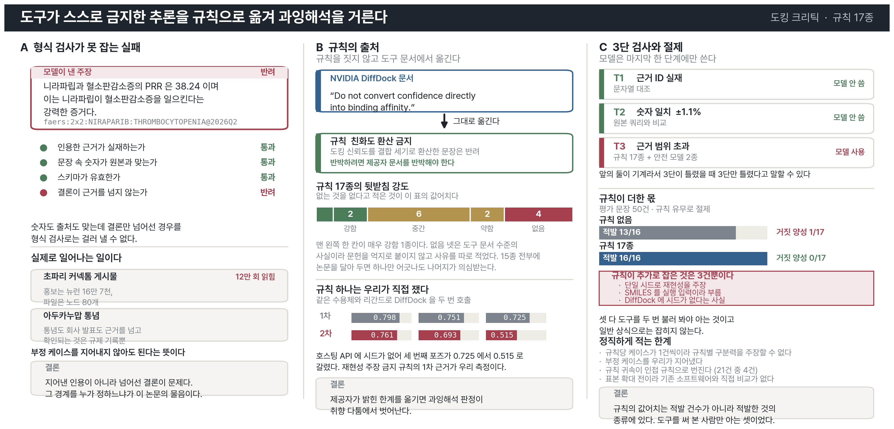

# 도킹 편 골격: 과잉해석 크리틱

**투고처** arXiv 선공개 + ML 워크숍 단편 4~8쪽. 게재료가 없고 표본이 작은 방법론 단편을
받는 자리다. NeurIPS AI4Science 나 ICLR 의 신약개발 워크숍 계열이 대상이다.

**학술지 정식 게재는 표본 확대 후에만.** J Cheminformatics (IF 7.9)는 완전 공개라
USD 2,390 이 필수이고, "기존 소프트웨어 대비 상당한 진전을 보통 직접 비교로 입증"을 요구한다.
지금 상태로 내면 그 문턱에 그대로 걸린다.

**상세 계획은 `docs/notes/05-research/paper-plan.md`(589줄)에 이미 있다.** 이 문서는 그 계획을
줄인 것이 아니고, **투고 형태가 바뀐 뒤의 골격과 새로 드러난 위험만** 적는다.

---

## 기승전결

**기.** 모델이 낸 요약에서 숫자도 맞고 출처도 실재하는데 결론만 근거를 넘는 경우가 있다.
형식 검사로는 이것을 못 거른다. 스키마도 통과하고 인용도 붙어 있기 때문이다.

**승.** 넘었는지 아닌지를 누가 정하는가가 문제다. 직접 기준을 지으면 취향 다툼이 된다.
**도구와 데이터 제공자가 문서에 적어 둔 금지 문장을 그대로 규칙으로 옮기면 그 다툼이
사라진다.** 반박하려면 만든 쪽의 문서를 반박해야 한다.

**전.** 그렇게 모은 규칙 17종으로 재 보니, 규칙 없는 일반 판정도 16건 중 13건을 잡는다.
**규칙이 추가로 잡은 것은 3건뿐이다.** 다만 그 셋은 도구를 실제로 써 본 사람만 아는
것이었다. 시드 없는 API 를 두 번 불러야 알 수 있는 재현성 문제 같은 것이다.

**결.** 규칙의 값어치는 적발 건수가 아니라 **적발한 것의 종류**에 있다. 그리고 규칙마다
뒷받침 강도를 매겨 보니 넷은 뒷받침이 없었고, 없다고 적었다. 억지로 문헌을 달지 않는 것이
규칙 목록의 신뢰를 지킨다.

**방법.** 평가 문장 50건(틀린 주장 31, 정상 6, 구조 규칙 13)에 3단 검사를 건다. 1단은 근거
ID 실재, 2단은 숫자 일치(±1.1%), 3단만 모델이 본다. 규칙 유무로 절제한다.

## Abstract 초안 (워크숍 단편)

> Claims generated from computational tools can be wrong while every citation resolves and
> every number matches its source. We describe a critic that separates this failure from
> fabrication: two deterministic stages check evidence-identifier existence and numeric
> agreement, and only the residual question — whether the conclusion exceeds what the
> evidence licenses — is put to a model. The rule set is not authored but transcribed from
> limitations that tool and data providers state in their own documentation, which makes
> each rule checkable against a citable source rather than a matter of taste. On 50
> evaluation statements the rules raise detection from 13/16 to 16/16 with no false
> positives; we report that the three additional detections all concern tool behaviour that
> is invisible without running the tool, and that 4 of 17 rules have no literature support,
> which we state rather than supply.

## 그래픽 초록



`scripts/figures/ga_docking_critic.py`. 본편과 같은 시각 문법을 쓴다.

| 칸 | 담는 것 |
|---|---|
| A | 형식 검사가 못 잡는 실패. 인용과 숫자와 스키마는 통과하는데 결론만 넘어선다 |
| B | **규칙의 출처.** 제공자 문서의 한 문장에서 규칙으로 내려오는 화살표 |
| C | 3단 검사와 절제. 규칙이 더한 3건이 어떤 종류인지 |

**B 의 화살표가 이 그림의 주장이다.** 인용부호가 붙은 문서 문장이 규칙 카드로 그대로
내려간다. 규칙을 우리가 지은 것이 아니라는 사실이 그 화살표 하나에 들어 있다.

C 는 적발 건수를 크게 쓰지 않는다. 13/16 과 16/16 의 차이가 3건뿐이라는 것을 먼저 보이고,
그 셋이 도구를 두 번 불러 봐야 아는 것이라는 데서 규칙의 존재 이유를 말한다.

---

## 핵심 그림 한 장

```
규칙 없음                    규칙 17종
  적발 13/16                   적발 16/16
  거짓 양성 1/17               거짓 양성 0/17
        │
        └── 추가로 잡은 3건 ──┬── 단일 시드 재현성 주장
                              ├── SMILES 를 실행 입력이라 부름
                              └── DiffDock 에 시드가 없다는 사실

  ※ 셋 다 도구를 두 번 불러 봐야 아는 것
```

**막대 높이보다 화살표 끝의 세 줄이 주장이다.** 3건이 적다는 사실을 먼저 적고,
그 셋의 성격으로 규칙의 존재 이유를 말한다.

---

## 논지 한 문장

> 도구 제공자가 문서에 적어 둔 금지 문장을 규칙의 원본으로 삼으면, 근거와 수치가 모두 맞는데
> 결론만 근거를 넘는 주장을 기계로 걸러낼 수 있다.

**이 문장이 본편의 방법 절에도 한 단락으로 들어간다.** 두 편이 겹치는 유일한 지점이고,
본편에서는 방법의 출처 규율로, 여기서는 중심 주장으로 쓴다.

## 고유 자산 둘

이것 때문에 접지 않는다.

**1. 우리가 직접 잰 규칙 하나.** DiffDock 호스팅 API 에 시드 파라미터가 없어 같은 수용체와
리간드를 두 번 부르면 신뢰도가 갈렸다.

```
1차  [0.798, 0.751, 0.725]
2차  [0.761, 0.693, 0.515]
```

재현성 주장 금지 규칙의 1차 근거가 남의 논문이 아니라 우리 측정이다.

**2. 규칙 17종의 뒷받침 등급표.** 매우 강함 1, 강함 2, 중간 6, 약함 2, 없음 4.
`literature_source` 와 `literature_quote` 가 코드에 있고 `tests/test_overclaim_rules.py`
가 표와의 불일치를 잡는다. **뒷받침이 없는 넷을 없다고 적은 것이 이 표의 값어치다.**

---

## 절 구성 (워크숍 단편 4~8쪽)

### 1. 문제

**주장.** 형식 검사로는 "근거와 수치는 맞는데 결론만 넘어선" 주장을 못 거른다.

**있는 것.** 실제 사례 둘.
- 초파리 커넥톰 게시물. 노드 80개, 엣지 1,296개인데 16만 7천 뉴런으로 홍보. 파일 본문에
  "Not a physiological or whole-brain model" 이 적혀 있다
- 아두카누맙. 통념(부작용 퇴출)도 회사 발표(자원 재배치)도 근거를 넘고, 확인되는 것은
  급여 제한과 신청 철회라는 규제 기록뿐이다

**둘 다 우리가 지어낸 것이 아니라는 점이 중요하다.** 심사자는 "이 실패가 실제로 일어나는가"
를 묻는다.

### 2. 규칙의 출처 규율 (중심 기여)

**주장.** 규칙을 직접 짓지 않고 도구와 데이터 제공자의 문서에서 옮긴다.

예. NVIDIA DiffDock 문서의 "Do not convert confidence directly into binding affinity."

**왜 이게 기여인가.** 과잉해석 판정은 취향 다툼이 되기 쉽다. 제공자가 금지한 것을 기준으로
삼으면 반박하려면 제공자 문서를 반박해야 한다.

**이중 귀속.** 도킹 서비스는 팀원의 별도 저작물이라 빠질 수 있으므로 문헌 출처를 따로 달았다.
17종 중 12종이 문헌이나 NVIDIA 문서로 독립해 선다.

### 3. 3단 검사

| 단계 | 하는 일 | 모델 |
|---|---|---|
| T1 | 근거 ID 실재 | 안 씀 |
| T2 | 숫자 일치 (±1.1%) | 안 씀 |
| T3 | 근거 범위 초과 | 씀 |

**앞의 둘을 모델 없이 두는 것이 설계의 핵심이다.** 3단이 틀렸을 때 3단만 틀렸다고 말할 수 있다.

### 4. 절제

**있는 것.** 규칙 없는 일반 판정 13/16 에 거짓 양성 1/17. 규칙 15종을 넣으면 16/16 에 0/17.

**정직하게 적을 것. 규칙이 더한 것은 3건뿐이다.** 단일 시드 재현성 주장, SMILES 를 실행
입력이라 부르는 것, DiffDock 에 시드가 없다는 사실.

**그 3건의 성격이 중요하다.** 셋 다 도구를 실제로 써 본 사람만 아는 것이고 일반 상식으로는
안 잡힌다. 이것이 규칙 목록의 존재 이유다.

### 5. 한계

1. **규칙당 케이스가 1건씩 심긴 구조라 규칙별 구분력을 주장할 수 없다**
2. 부정 케이스를 우리가 지어냈다. 1절의 실제 사례 둘로 보완하되 대체되지 않는다
3. 규칙 귀속이 인접 규칙으로 번진다 (21건 중 4건). 고정 단계는 정확하고 모델 단계가 번진다
4. 표본 확대 전이라 기존 소프트웨어와 직접 비교가 없다

---

## 선행연구에 반드시 더할 것

`paper-plan.md` 의 선행연구 표(L181-197)와 선점 위험 네 건(L138-177)에 **없는** 것들이다.

| 문헌 | 왜 |
|---|---|
| **arXiv:2607.17417** | 화학과 재료 추론의 근거 기반 검증. **구조가 가장 가깝다** |
| **arXiv:2609.26550** (Li 2026) | 선점 문헌 목록 L513-519 에 아직 없다 |
| **SciRigor arXiv:2609.06192** | `paper-plan.md` 가 "가장 위험하다" 고 판정. `full` 분석 필요 |

## 아직 본문을 안 읽은 것

`paper-plan.md` L541 이 스스로 적었다. 기권과 보정 선점 문헌 다섯 편이 초록 수준이다.
**기권을 헤드라인에서 내렸으므로 그 다섯은 서지만 확보하고 넘어간다.**

전문이 필요한 것은 둘이다. J Cheminform 18:100 (2026-05)과 Bioinformatics 42(8) btag550.
전자는 "구조가 가장 가깝다" 고 적어 두고 미독이고, 후자는 장르 선례다.

---

## 순서

1. **arXiv 선공개.** 본편 초고 뒤. 지금 있는 것으로 4~8쪽이 된다
2. **표본 확대.** 생성으로 되는 일이라 본편을 쓰는 동안 백그라운드로 돌린다
3. **워크숍 투고.** 마감에 맞춰 본편 일정을 밀지 않는다
4. **J Cheminformatics.** 표본 확대가 끝나고 게재료 부담 주체가 정해진 뒤

**팀원 동의가 먼저다.** 재료가 팀원 자산(도킹 결과)을 포함한다. 저자 표기와 출품 여부를
1번 전에 묻는다.
