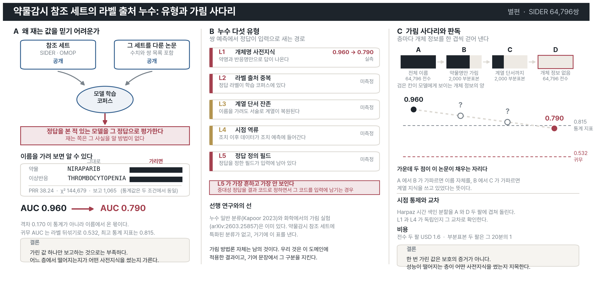

# 별편 골격: 약물감시 누수 프로토콜

**투고처** JAMIA (IF 7.1). 구독 방식이라 저자 부담이 없다. 분량이 짧으므로 Research and
Applications 또는 Brief Communication 형식을 확인한다 [미확인].

**본편과 겹치지 않게** 중심을 누수 유형화에 둔다. 본편은 라벨 계열과 경로 설계가 중심이고
누수는 한 절이다. 이쪽은 누수가 전부다.

---

## 기승전결

**기.** 공개 참조 세트로 LLM 성능을 재면 그 세트를 다룬 논문도 공개돼 있다. 모델이 정답표를
이미 본 상태에서 재는 셈인데, 재는 쪽은 그것을 알 방법이 없다.

**승.** 이름을 가리고 다시 재면 알 수 있다. AUC 가 0.960 에서 0.790 으로 내려갔다.
**그 0.170 이 통계가 아니라 이름에서 온 몫이다.**

**전.** 그런데 한 번 가리는 것으로는 부족하다. 화학 쪽 연구는 속성명만 가려서는 보호되지
않고 목표값 변환까지 해야 우연 수준으로 내려간다고 보고했다. 이름을 지워도 임상 서술의
문맥만으로 약물 계열이 복원되면 누수가 남는다.

**결.** 가림을 사다리로 나누면 각 층이 얼마씩 기여했는지 분리된다. 전체 이름, 약물명만
가림, 계열 단서까지 가림, 완전 익명화 네 단계다. **이 절차와 누수 다섯 유형이 이 논문이
내놓는 것이다.**

**방법.** SIDER 64,796쌍에 A 와 D 를 전수로, B 와 C 를 2,000쌍 부분표본으로 돌린다.
귀무 AUC 는 라벨 뒤섞기로 구한다. Harpaz 시간 색인 분할을 겹쳐 시점 누수와 이름 누수가
독립인지 확인한다.

## Abstract 초안

> **Objective.** Public reference sets used to benchmark large language models in drug
> safety are themselves public, so a model may reproduce a label it has memorised rather
> than infer it. We ask how much of the measured discrimination is attributable to
> entity-name priors, and propose a procedure that separates the contributions.
>
> **Methods.** We define five leakage types for drug–adverse-event pair prediction and a
> four-rung blinding ladder (full names; drug name masked; drug name and class cues masked;
> full anonymisation). Null AUC is obtained by label permutation on the same data. The
> ladder is crossed with a time-indexed split to test whether name leakage and temporal
> leakage are independent.
>
> **Results.** [실험 1, 3 으로 채운다.] Pilot: AUC 0.960 → 0.790 between the outer rungs,
> against a permutation null of 0.532 and a best-statistical-measure value of 0.815.
>
> **Conclusion.** Reporting a single blinded number is not enough; the rung at which
> performance falls identifies which prior the model was using.

## 그래픽 초록



`scripts/figures/ga_ml_leakage.py`. 본편과 같은 시각 문법을 쓴다.

| 칸 | 담는 것 |
|---|---|
| A | 오염 경로. 참조 세트와 그 세트를 다룬 논문이 모두 공개라 학습 코퍼스로 들어간다 |
| B | **누수 다섯 유형.** 각 유형이 어디로 들어오고 무엇을 부풀리는지, 실측인지 미측정인지 |
| C | 가림 사다리 네 층과 하강 곡선. 가운데 두 점이 이 논문이 채우는 자리다 |

**C 의 물음표 두 개가 기여를 가리킨다.** 양 끝 두 점은 이미 쟀고, 그 사이가 비어 있어
어떤 사전지식이 답을 만들었는지 아직 모른다. 그 두 점을 채우는 것이 이 논문이다.

A 의 가림 카드는 본편과 같은 그림이다. 일부러 같게 두어 두 편이 한 연구에서 나왔다는 것이
보이게 했다.

---

## 핵심 그림 한 장

```
AUC
0.96 ┤ ●  A 전체 이름
     │  ＼
     │    ＼ ●  B 약물명만 가림
     │       ＼
     │         ＼ ●  C 계열 단서까지
0.79 ┤            ● D 개체 정보 없음
0.53 ┤ ─ ─ ─ ─ ─ ─ ─  귀무 (라벨 뒤섞기)
     └──────────────
```

**어느 구간이 가파른지가 결과다.** A에서 B가 가파르면 이름 자체를, B에서 C가 가파르면
계열 지식을 쓰고 있었다는 뜻이다. 지금은 양 끝 두 점만 있다.

---

## 제목 후안

1. Label provenance leakage in pharmacovigilance signal prediction:
   a taxonomy and a blinding ladder
2. When the model already knows the answer: diagnosing name-prior leakage
   in drug safety reference sets

**1안을 쓴다.** 기여가 분류 체계와 측정 절차 둘이라 제목에 둘을 넣는다.

## 논지 한 문장

> 약물-이상반응 쌍 예측에서 **라벨 출처와 모델 사전지식이 같은 코퍼스에서 오는 구조적 누수**를
> 유형화하고, 가림 단계를 사다리로 나눠 각 유형의 기여분을 정량화하는 절차를 낸다.

## 비어 있는 자리

검색으로 선례가 나오지 않았다. 생의학 ML 일반(Kapoor & Narayanan 2023, Patterns)과 화학
가림 연구(arXiv:2603.25857)는 있는데, **약물감시 참조 세트에 특화된 누수 분류가 없다.**

**다만 가림 방법론 자체는 남의 것이다.** 우리 것은 약물감시 참조 세트에 적용한 결과이고,
기여 문장에서 이 구분을 지킨다.

---

## 절 구성

### 1. 서론

**주장.** 공개 참조 세트로 LLM 성능을 재면 그 세트를 다룬 논문도 공개돼 있어 정답표를 본
모델을 재게 된다.

**있는 것.** 0.960 대 0.790. 이름을 가리자 AUC 가 0.170 떨어졌다.

**필요한 것.** 이 격차에 표준 이름을 붙인다. Kapoor & Narayanan 의 누수 8유형 가운데
어디에 해당하는지 대응시킨다.

### 2. 누수 유형 (중심 기여 1)

**주장.** 약물감시 쌍 예측의 누수를 다섯 유형으로 나눈다.

**필요한 것.** 아래 초안을 문헌과 대조해 확정.

| 유형 | 무엇 | 우리 증거 |
|---|---|---|
| L1 개체명 사전지식 | 약명과 반응명만으로 답이 나온다 | 0.960 → 0.790 |
| L2 라벨 출처 중복 | 정답 라벨이 모델 학습 코퍼스에 있다 | OMOP, SIDER 가 공개 |
| L3 계열 단서 잔존 | 이름을 가려도 임상 서술로 약물 계열이 복원된다 | **실험 3 필요** |
| L4 시점 역류 | 조치 이후 데이터가 조치 예측에 들어간다 | 2013년 이전으로 자름 |
| L5 정답 정의 필드 | 정답을 정한 필드가 입력에 남아 있다 | 결과 코드를 가림 |

**L5 가 가장 흔하고 가장 안 보인다.** 저희도 팀 약사가 짚어 줘서 알았다.

### 3. 가림 사다리 (중심 기여 2)

**주장.** 가림을 한 번에 하지 않고 단계로 나누면 각 유형의 기여분이 분리된다.

```
A  전체 이름 보임
B  약물명만 가림
C  약물명과 ATC 계열 단서까지 가림
D  개체 정보 없음 (통계 숫자만)
```

**필요한 것. 실험 1과 실험 3.** A 와 D 는 전수(64,796쌍, 약 USD 1.6), B 와 C 는
2,000쌍 부분표본(비용 20분의 1).

**A와 D만 재면 안 되는 이유.** 그 둘의 차이는 "이름이 기여한 전부"인데, 그중 얼마가
정당한 약리 정보이고 얼마가 정답 암기인지 가르지 못한다. B 와 C 가 그것을 가른다.

**이 사다리가 "가림이 정당한 약리 정보까지 없앤다"는 반박을 미리 막는다.**

### 4. 기준선

**주장.** 귀무 AUC 를 라벨 뒤섞기로 구한다.

**있는 것.** 겹침 42퍼센트에서 귀무 0.532. 지표 7종 비교.

### 5. 시점 통제

**있는 것.** 2013년 라벨 변경 57건 중 21건, 오경보 70건 중 1건. 2013년 이전 보고만 사용.

**필요한 것.** Harpaz 시간 색인 분할을 A 와 D 두 팔로 겹쳐 실행. 시점 통제와 이름 가림을
교차하면 L1 과 L4 가 독립인지 확인된다.

### 6. 한계

1. 가림을 문자열 치환으로 한다. 완전 익명화가 아니다
2. 모델 하나에서만 쟀다. 실험 4의 오픈소스 재현이 필요하다
3. 참조 세트가 낡았다. PVLens 2025 가 SIDER 의 오류를 지적했다

---

## 본편과의 선

| | 본편 | 별편 |
|---|---|---|
| 0.960 대 0.790 | 누수 증거 (한 절) | 유형 분류의 사례 (중심) |
| 가림 사다리 | 실험 하나 | **절차로 제시** |
| 라벨 네 계열 | 중심 | 인용만 |
| 경로 설계 | 중심 | 없음 |

**같은 수치를 쓰지만 역할이 다르다.** 중복 게재가 되지 않도록 별편 서론에서 본편을 인용하고
"그 논문의 4절을 절차로 일반화한다"고 명시한다.

## 쓰는 순서

**본편 뒤에 쓴다.** 실험 1과 3이 끝나야 2절과 3절이 채워지고, 본편이 arXiv 에 먼저 올라가
있어야 인용할 수 있다.
