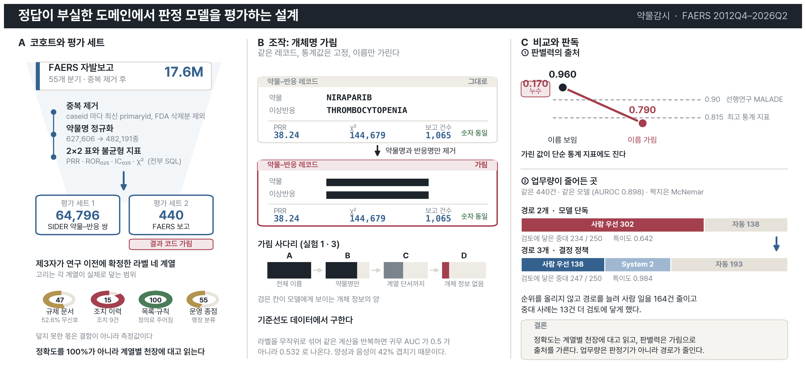

# 본편 골격: 판정기 평가 설계

**투고처** Drug Safety (IF 5.9, Q1). 반려 시 Pharmacoepidemiology and Drug Safety (IF 2.6).
구독 방식으로 내므로 저자 부담이 없다. arXiv 선공개를 먼저 한다.

**보고 기준** READUS-PV 를 초고 단계에서 맞춘다. Drug Safety 는 불균형 분석 논문에 이 기준
준수를 요구한다.

---

## 기승전결

한 문단으로 줄이면 이런 이야기다.

**기.** 약물감시 판정을 자동화하려면 정답이 필요한데, 이 도메인은 사람끼리도 판정이 맞지
않는다. 척도 없이 판정한 전문가 6명의 카파가 0.21~0.40 이고, 도구를 WHO-UMC 에서 Naranjo 로
바꾸면 같은 399건의 결론이 53.3퍼센트 확실함에서 96.74퍼센트 가능성 높음으로 옮겨간다.
**정답을 만들 수 없는 곳에서 모델을 어떻게 평가하는가** 가 이 논문의 물음이다.

**승.** 저자가 정답을 만드는 대신, 연구 이전에 제3자가 확정하고 기계로 대조 가능한 라벨
네 계열을 쓴다. 규제 문서 원문, 규제 조치 이력, 규제 목록과 규칙, 운영 종점이다.
**각 계열은 그 자체로 불완전하므로 계열마다 노이즈 상한을 함께 잰다.** 라벨에 기재된 쌍의
52.6퍼센트에 불균형 신호가 서지 않고, 규제 조치는 9건뿐이라 오경보의 분모가 없다.
정확도를 100퍼센트가 아니라 이 상한에 대고 읽는다.

**전.** 그렇게 재 보니 두 가지가 뒤집힌다. 첫째, OMOP 참조 세트에서 AUC 0.960 이 나오는데
약물명과 반응명을 가리면 0.790 으로 내려간다. **판별력의 상당 부분이 통계가 아니라 개체명
사전지식에서 왔다.** 0.790 은 같은 세트 최고 통계 지표 0.815 에도 진다. 둘째, 모델 단독의
중대성 AUROC 가 0.898 로 이미 높은데 사람이 먼저 볼 건수는 302건이다. 순위가 좋아도
업무량이 줄지 않는다.

**결.** 업무량을 줄인 것은 모델이 아니라 경로였다. 확률을 기한과 사유가 붙은 세 경로로
바꾸자 302건이 138건이 되고 검토에 닿은 중대 사례는 234건에서 247건으로 늘었다.
경로는 규제가 정의한다(미국 15일, 한국 15일, EMA DME, GVP Module IX 의 3개월과 6개월).
**판정기 성능을 올리는 것만이 길이 아니다.**

**방법.** FAERS 55개 분기 1,760만 건 위에 SIDER 64,796쌍과 OMOP, EU-ADR 참조 세트를 얹고,
비자기회귀 결정 모델과 대형 언어 모델을 경로에 따라 나눠 부른다. 귀무 AUC 는 라벨 뒤섞기로
데이터에서 직접 구하고(겹침 42퍼센트에서 0.532), 짝지은 440건에 McNemar 를 쓴다.
이름 가림은 전체 이름, 계열 단서만, 완전 익명화 세 단계로 나눈다.

---

## 그래픽 초록



`scripts/figures/ga_pv_main.py` 로 그린다. 공통 시각 문법은 `ga_style.py` 에 있고 세 편이
같은 머리띠와 카드 모양과 팔레트를 쓴다. 색이 뜻을 나른다. 파랑은 파이프라인과 그 산출,
빨강은 경고하는 것, 초록은 검증을 견딘 것, 모래색은 부분 적용이다.

**주장 목록이 아니라 스터디 디자인을 담는다.** 어디서 온 데이터인지, 무엇을 조작했는지,
무엇과 무엇을 견줬는지, 무엇이 나왔는지가 순서대로 들어간다.

| 칸 | 담는 것 |
|---|---|
| A | 코호트와 평가 세트. FAERS 17.6M 에서 SIDER 64,796쌍과 FAERS 440건까지, 라벨 네 계열의 천장 |
| B | **조작.** 같은 레코드를 이름 보임과 가림 두 조건으로 놓는다. 통계값은 고정 |
| C | 비교와 판독. 판별력 0.960→0.790 과 업무량 302→138 |

**B 의 검은 가림 막대가 이 그림의 주장이다.** 두 카드가 이름 칸 말고는 같은데 한쪽은
0.960 이고 한쪽은 0.790 이다. 그것만 가져가도 논문을 가져간 것이다.

C 안에서도 ①이 ②보다 앞이다. 우리 수치를 깎는 결과를 그림 안에서도 먼저 놓았고,
본문 절 배치와 같은 순서다.

**투고처가 그래픽 초록을 받는지 확인해야 한다** [미확인]. 받지 않더라도 arXiv 선공개와
발표 자료에 그대로 쓴다.

---

## 그림과 표: 논문이 어떻게 보일 것인가

심사자가 기억하는 것은 문장이 아니라 그림이다. 다섯 장과 표 셋으로 이야기가 끝나야 한다.

### 그림 1. 가림 사다리 (논문의 얼굴)

```
AUC
1.00 ┤
     │   ●  0.960   이름 보임
0.95 ┤   │
     │   │                        ← 이 간격 0.170 이 논문의 주장
0.90 ┤   │          ○  0.90   MALADE (선행연구)
     │   │
0.85 ┤   │
     │   ▼          △  0.815  같은 세트 최고 통계 지표
0.80 ┤   ●  0.790   이름 가림
     │
0.75 ┤
     └───────────────────────────────────────
          우리          비교 대상
```

독자가 보는 것은 하나다. **화살표가 아래를 향한다.** 이름을 가리자 우리 값이 선행연구
아래로, 그리고 단순 통계 지표 아래로 내려간다. 논문이 자기 수치를 스스로 깎는 그림이라
심사자의 첫 방어선을 먼저 무너뜨린다.

**지금 있는 것.** 네 점 모두. **필요한 것.** 실험 1 전수로 신뢰구간을 붙이는 일.

### 그림 2. 부분 가림 곡선

```
AUC
0.96 ┤ ●
     │  ＼
0.90 ┤    ＼ ●            A  전체 이름
     │       ＼           B  약물명만 가림
0.85 ┤         ＼ ●       C  약물명과 계열 단서까지
     │            ＼      D  개체 정보 없음
0.79 ┤              ●
     └──A───B───C───D──
```

그림 1이 "이름이 기여한다" 를 보이면, 그림 2는 **그 기여가 어디서 끊기는지**를 보인다.
B 에서 많이 떨어지면 이름 자체가, C 에서 떨어지면 계열 지식이 답을 만들고 있었다는 뜻이다.
"가림이 정당한 약리 정보까지 없앤다" 는 반박을 이 곡선 하나가 막는다.

**필요한 것.** 실험 3. 2,000쌍이면 되고 비용은 실험 1의 20분의 1이다.

### 그림 3. 경로 설계 (두 번째 기여)

왼쪽과 오른쪽을 나란히 놓는다.

```
  모델 단독                        워크플로
  ─────────                       ─────────
  확률 ──┬── >0.5 ─→ 사람 302건    확률 ──┬── 높음 ──→ 사람      138건
         └── ≤0.5 ─→ 자동                ├── 애매 ──→ System 2  검토
                                         └── 낮음 ──→ 자동
  중대 234/250                     중대 247/250
  특이도 0.642                     특이도 0.984
  AUROC 0.898                      같은 모델
```

**같은 모델인데 오른쪽이 사람 일을 절반 아래로 줄이고 중대 사례는 더 찾는다.**
Li 2026 이 임계값 하나에 경로 둘을 두는 것과 갈라지는 지점이 이 그림이다.

**지금 있는 것.** 전부. 이 그림은 오늘 그릴 수 있다.

### 그림 4. 라벨 네 계열과 각자의 천장

```
계열                  이 계열로 잴 수 있는 상한
─────────────────────────────────────────────
규제 문서 원문        ████████░░  기재 쌍의 52.6%에 신호가 안 선다
규제 조치 이력        ██░░░░░░░░  조치 9건. 오경보 분모 없음
규제 목록과 규칙      ██████████  정의로 주어진다
운영 종점            █████░░░░░  행정 분류이지 임상 중대성이 아니다
```

**정확도를 100퍼센트가 아니라 이 막대에 대고 읽는다** 는 논문의 설계를 한 장으로 보인다.
막대가 다 차지 않은 것이 결함이 아니라 측정 결과라는 점이 이 그림의 뜻이다.

### 그림 5. 커넥톰 대조 (음성 결과)

```
AUC
      │        ┌─┐
      │     ┌──┤ ├──┐   ← 차수 보존 재배선 100회 분포
      │     │  └─┘  │
      │  ●  ←── 실측 커넥톰이 이 분포 안에 있으면 기여 없음
      │
      │  ●  ←── 투영 없음 (특징을 바로 판독)
      └──────────────────
```

**실측 점이 분포 안에 있으면 그것이 결과다.** 주장이 근거를 넘지 않게 하는 논문이 자기
비유를 스스로 검증해 기여가 아님을 보이면, 나머지 주장의 신뢰가 오른다.

**필요한 것.** 실험 6. CPU 만 쓰고 비용 0원.

### 표 1. 절제

그림 3의 근거다. 네 줄이면 된다.

| 조건 | 검토에 닿은 중대 | 사람 우선 | 특이도 |
|---|---|---|---|
| 워크플로 전체 | 247 / 250 | 138 | 0.984 |
| 라벨 근거 주입 없음 | 248 / 250 | 144 | 0.984 |
| DME 안전망 없음 | 247 / 250 | 137 | 0.984 |
| 모델 단독, 질문 하나 | 234 / 250 | 302 | 0.642 |

**가운데 두 줄이 거의 손해가 없다는 것을 감추지 않는다.** 이득의 출처가 경로 수와 결정
정책이라는 주장이 이 표에서 나온다.

### 표 2. 지표 일곱 종과 귀무 AUC

SIDER 64,796쌍. 귀무가 0.5 가 아니라 0.532 라는 것을 한 열로 보인다.

### 표 3. 평가자 일치도 비교

| 출처 | 무엇 사이의 일치인가 | 카파 |
|---|---|---|
| Naranjo 1981 | 척도 없는 전문가 6명 | 0.21 ~ 0.40 |
| Naranjo 1981 | 같은 전문가, 척도 사용 | 0.69 ~ 0.86 |
| More 2024 | **도구 둘 사이** (WHO-UMC 대 Naranjo) | 0.22 |
| 우리 (실험 2) | 약사 2인, 같은 100건 | [미측정] |

**세 번째 줄이 도구 간 일치도라는 것을 이 표가 못 박는다.** 우리 노트가 한때 이 숫자를
전문가 간 일치도로 잘못 인용했고, 표로 만들어 두면 다음 사람이 같은 실수를 하지 않는다.

---

## 이야기의 흐름

그림 순서가 곧 논문 순서다.

```
1절 서론        정답이 없다          (표 3)
   ↓
3절 라벨        그래서 이렇게 잰다    (그림 4)
   ↓
4절 누수        재 보니 이렇다 ①     (그림 1, 2)   ← 우리 수치를 깎는다
   ↓
5절 경로        재 보니 이렇다 ②     (그림 3, 표 1) ← 대신 여기서 이득이 온다
   ↓
6·7·8절 대조    다른 축은 안 된다     (표 2, 그림 5) ← 음성도 적는다
   ↓
10절 한계       아직 못 잰 것 여덟
```

**4절에서 우리 수치를 깎고 5절에서 다른 이득을 내놓는 배치가 이 논문의 구조다.**
0.960 을 앞세우는 논문은 심사자가 누수를 의심하는 순간 끝나지만, 누수를 우리가 먼저 재서
내놓으면 그다음 주장이 살아남는다.

---

## Abstract 초안 (구조화, Drug Safety 형식)

투고 시 영문이므로 영문으로 적는다. 단어 수 상한은 투고 규정 확인 후 맞춘다 [미확인].

> **Background.** Automating pharmacovigilance triage requires a ground truth, yet human
> causality assessment in this domain is unstable: six experts judging 63 adverse drug
> reactions without a scale agreed on 38–63% of cases (kappa 0.21–0.40), and applying two
> standard instruments to the same 399 reports classified 53.3% as certain under WHO-UMC
> but 96.74% as probable under Naranjo. Evaluations that treat author-generated labels as
> truth therefore report a number about the labelling, not the system.
>
> **Objective.** To define an evaluation design for decision models in domains where expert
> agreement is low, and to quantify how much of a model's apparent discrimination comes
> from statistical evidence rather than entity-name priors.
>
> **Methods.** We used four families of labels fixed by third parties before this study and
> checkable by machine: regulatory label text at subsection granularity, regulatory action
> history indexed by date, regulatory lists and rules (EMA DME, ICH E2D, Evans criteria),
> and operational endpoints. For each family we measured its own noise ceiling. Performance
> was read against that ceiling rather than against 100%. Null AUC was obtained by label
> permutation on the same data rather than assumed to be 0.5. Discrimination was decomposed
> with a blinding ladder (full names, class cues only, full anonymisation) on SIDER
> (64,796 pairs) and OMOP, with a time-indexed split. Routing was evaluated by ablation on
> 440 FAERS reports with outcome codes masked, using McNemar's test for paired comparison.
>
> **Results.** [실험 1, 2, 3, 6 결과로 채운다.] Pilot values: AUC fell from 0.960 with drug
> and reaction names visible to 0.790 when blinded, below the best statistical measure on
> the same set (0.815). Label permutation gave a null AUC of 0.532, not 0.5, because 42% of
> positive and negative pairs overlap. The model alone reached a seriousness AUROC of 0.898
> yet sent 302 of 440 reports to human-first review; adding intermediate routes reduced this
> to 138 while raising serious cases reaching review from 234/250 to 247/250 (p = 0.0044
> for cases left in the automated queue; p = 3.6 × 10⁻⁴⁸ for total human-first volume).
> Ablating label-evidence injection and the DME safety net changed detection by at most one
> case, locating the gain in route count and decision policy rather than in either component.
>
> **Conclusion.** [기여 셋을 한 문장씩.]

**채우기 전에는 초록을 확정하지 않는다.** Results 의 대괄호가 실험 1, 2, 3, 6 에 묶여 있다.

---

## 제목 후안

1. Evaluating decision models where expert agreement is low: third-party labels,
   their noise ceilings, and a leakage diagnosis in pharmacovigilance
2. What a pharmacovigilance triage model actually learns: label provenance,
   name-prior leakage, and route design

**1안을 쓴다.** 기여 셋이 제목에 다 들어간다.

## 논지 한 문장

> 전문가 일치도가 낮은 도메인에서, 저자가 만든 정답 대신 **연구 이전에 제3자가 확정하고
> 기계로 대조 가능한 라벨 네 계열**을 쓰고, 각 계열의 **자체 노이즈 상한을 함께 측정해**
> 정확도를 100퍼센트가 아니라 그 상한에 대고 읽는 평가 설계를 낸다.

## 기여 셋

| | 기여 | 증거 |
|---|---|---|
| (a) | 사람 정답이 부실할 때 쓰는 라벨 네 계열과 계열별 노이즈 상한 | 3절 |
| (b) | **이득이 순위가 아니라 경로 설계에서 온다** | 5절. 모델 단독 AUROC 0.898 인데 업무량 302건 |
| (c) | 개체명 사전지식 누수의 진단과 정량화 | 4절. 0.960 대 0.790 |

**(b)가 두 번째로 강한 기여다.** Li 2026(arXiv:2609.26550)이 임계값 하나에 경로 둘을 두는
것과 정면으로 갈라지는 지점이다.

## 죽은 것 (신규성으로 쓰지 않는다)

결정 전용 판정기를 1단에 두는 구성, 비용과 지연 우위, 확신 임계값 캐스케이드, 확신도가
오류를 정렬한다는 관찰, 보정 측정, 타입 출력이 유효성을 보장한다는 주장.

**2026-09-22 에 Li 2026 이 일반 벤치마크에서 먼저 측정했다.** 2026-09-26 에 기권과 위험
커버리지 곡선을 헤드라인에서 내린 판단이 결과적으로 정확했다.

---

## 절 구성

### 1. 서론

**주장.** 약물감시 판정을 자동화하려면 정답이 필요한데, 이 도메인의 사람 정답은 서로 맞지 않는다.

**있는 것.**
- 과소보고 94퍼센트 (Hazell & Shakir 2006, PMID 16689555. 연구 37건 중앙값, IQR 82-98)
- 척도 없는 전문가 6명의 카파 0.21~0.40 (Naranjo 1981, Clin Pharmacol Ther 30:239-45)
- 도구를 바꾸면 결론이 바뀐다. WHO-UMC 53.3% 확실 대 Naranjo 96.74% 가능성 높음
  (More 2024, PMID 38768933)
- 물량 문제의 규제 증거: MHRA 실사 지적 사유 셋
- 업계가 자동화하고 싶다고 꼽은 자리 (TransCelerate 15개사, PMID 32036574)

**필요한 것.** 첫 단락에 **선행연구 인정**을 넣는다. 음성 쌍 문제는 Hauben 2016
(Drug Saf 39:421-32)과 Slattery 2016 이 10년 전에 제기했다. **우리는 그 진단에 측정을
붙인다**로 시작한다.

### 2. 관련연구

**있는 것.** 문헌 분석 1계층 (`_local/research/jev/li-2026-jev-judge/`)

**필요한 것.** 1계층 4편의 `full` 분석.

| 문헌 | 왜 |
|---|---|
| arXiv:2608.29127 (de Oliveira 등) | 사람 정답이 부실할 때의 라벨. 기여 (a)와 정면 |
| MALADE (arXiv:2408.01869, MLHC 2024) | **우리가 넘어야 하는 바.** OMOP AUROC 0.90 |
| Ryan 2013 + Hauben 2016 | 음성 쌍 정의가 핵심 쟁점 |
| Richards 2015 + Tavtigian 2018/2020 | 등급 체계의 계보. 형식만 인용하면 흉내로 읽힌다 |

**가장 위험한 것을 먼저 확보한다.** Uesawa 2026 (Drug Safety, 10.1007/s40264-026-01726-x)
이 "Claim-Strength Framework" 라는 이름과 원리를 먼저 게재했다. 그쪽은 방법론 리뷰이고
기계 구현, 라벨 계열, 누수 측정이 없으므로 **"이 프레임워크를 기계로 구현하고 라벨 노이즈
상한과 누수를 함께 측정한 첫 사례"** 로 재배치한다. **모르는 채 투고하면 치명적이다.**

### 3. 라벨 네 계열

**주장.** 저자가 정답을 만들지 않고, 연구 이전에 제3자가 확정한 라벨만 쓴다.

**있는 것.** 네 계열 전부.

| 계열 | 라벨 | 노이즈 상한 |
|---|---|---|
| 규제 문서 원문 | 라벨 절과 번호 소항목, 박스 경고, 인과 미확립 단서 | 라벨 기재 쌍의 **52.6%** 에 SDR 이 서지 않는다 |
| 규제 조치 이력 | 라벨 변경일 기준 시간 색인 | 조치 9건만 되짚어 **오경보 분모가 없다.** 기준 초과 쌍 826,277건 |
| 규제 목록과 규칙 | EMA DME, ICH E2D 최소 4요소, Evans 기준 | 고정 규칙이라 상한이 정의로 주어진다 |
| 운영 종점 | 결과 코드를 가린 중대성, 사람이 읽은 건수 | 결과 코드는 임상 중대성이 아니라 행정 분류다 |

**필요한 것.** 계열별 노이즈 상한 표를 하나로 정리. PVLens 2025 (arXiv:2503.20639)가
**"SIDER 는 낡았고 오류가 있다"** 고 본문에 적었으므로, SIDER 를 주 라벨로 쓰는 근거와
그 한계를 이 절에서 미리 다룬다.

### 4. 누수 진단 사다리

**주장.** 판별력 가운데 얼마가 통계에서 오고 얼마가 개체명 사전지식에서 오는지 분해한다.

**있는 것.** 10건 사례. 이름 보임에서 가림으로 바꾸자 4/10 걸러내던 것이 0/10 이 됐다.

**필요한 것. 실험 1과 실험 3.**

실험 1은 SIDER 64,796쌍 전수, 팔마다 약 37M 토큰, **약 USD 1.6**.
파일럿 200쌍은 양성이 12쌍뿐이라 어느 AUC 도 귀무 구간을 못 벗어났다.

**실험 3이 본 실험이 된다.** arXiv:2603.25857 이 화학에서 **속성명만 가리면 보호되지 않고
목표값 변환까지 해야 우연 수준으로 내려간다**는 결과를 냈다. 우리 0.790 도 완전히 가린 값이
아닐 수 있다. 가림을 셋으로 쪼갠다.

```
전체 이름 보임  →  ATC 계열 단서만 남김  →  개체 정보 없음
```

단계별 하강 곡선이 단일 가림보다 훨씬 강하다. arXiv:2604.06013 (Epistemic Blinding)을
방법론 근거로 함께 인용한다.

**그림 한 장이 논문의 얼굴이다.** 이름 보임 0.960, 가림 0.790, 최고 통계 지표 0.815,
MALADE 0.90 을 같은 축에.

### 5. 경로 설계 절제

**주장.** 판정 모델의 순위 성능이 같아도, 확률을 기한과 사유가 붙은 여러 경로로 바꾸는
결정 정책이 사람 업무량을 절반 아래로 줄인다.

**있는 것. 전부. 지금 쓸 수 있다.**

| 조건 | 검토에 닿은 중대 | 사람 우선 | 특이도 |
|---|---|---|---|
| FlyVigilance 워크플로 | 247 / 250 | **138** | 0.984 |
| 라벨 근거 주입 없음 | **248 / 250** | 144 | 0.984 |
| DME 안전망 없음 | 247 / 250 | 137 | 0.984 |
| 모델 단독, 질문 하나 | 234 / 250 | **302** | 0.642 |

모델 단독 중대성 AUROC 0.898. McNemar 로 자동 큐 잔존 중대 p=0.0044, 사람 우선 전체
p=3.6×10⁻⁴⁸.

**정직하게 적을 것.** 두 절제는 이 지표에서 거의 손해가 없다. 라벨 주입을 빼면 오히려 248 로
하나 더 닿는다. **즉 이득의 원천은 경로 수와 결정 정책이다.** 감추면 절제 표를 실은 의미가 없다.
라벨 주입을 남긴 이유는 다른 지표, 곧 확률이 0.04 와 0.87 로 갈려 임계값을 정할 수 있게
되는 데 있다.

**경로가 임의 설계가 아니다.** 미국 21 CFR 314.80 의 15일, 한국 약사법 시행규칙의 15일,
EMA DME 목록, EMA GVP Module IX 의 3개월/6개월이 경로를 정의한다.

**필요한 것.** 경쟁자 확인. Warner 2026 (Clin Pharmacol Ther, 10.1002/cpt.70409)이 산업계에서
이미 업무량 효율 개선을 보고했다. 우리 기여와 어떻게 다른지 한 단락.

### 6. 지표 기준선

**주장.** 귀무 AUC 를 라벨 뒤섞기로 구해야 한다. 0.5 는 이 데이터의 바닥이 아니다.

**있는 것. 전부.** SIDER 64,796쌍, 지표 7종, 겹침 42퍼센트라 귀무가 0.532.

**필요한 것.** 없음. Harpaz 2013 (Clin Pharmacol Ther)이 직계 선행이고 Evans 2001 이
기준의 원논문이다.

### 7. 기전 타당성 축 음성 결과

**주장.** Open Targets 기반 기전 타당성 축은 판별에 기여하지 않는다.

**있는 것. 전부.** 17,472쌍, AUC 0.559 대 귀무 0.532.

**필요한 것.** 문헌 오염 검증. Open Targets 의 연관이 문헌에서 오면 정답과 같은 출처다.

### 8. 커넥톰 대조

**주장.** 실측 배선은 차수 보존 재배선을 넘지 못한다 (예상).

**있는 것.** 부분그래프 49,244뉴런, 1,051,255연결 (CSR).

**필요한 것. 실험 6.** 대조 넷: 차수 보존 재배선 100회, 밀도 맞춘 무작위 희소 투영,
조밀 무작위 투영, **투영 없음**. CPU 만 쓰고 비용 0원.

**선행이 음성이다.** FlyHash-Connectome 이 유사도 검색에서 실측 0.4063 대 무작위 0.4148
(-2.06%)를 냈다.

**이 절을 넣는 이유.** 주장이 근거를 넘지 않게 하는 논문이 자기 비유를 스스로 검증해
기여가 아님을 보이면 논문 전체의 신뢰가 오른다.

### 9. 재현성

**있는 것.** 표기 변동 0/126, 503 폴백 3.2%.

**필요한 것. 실험 4와 5.**

실험 4는 **게재 요건이다.** 유료 독점 단일 버전 하나만 평가한 것은 재현성을 요구하는
학술지에서 반려 사유가 된다. 오픈소스 System One 드롭인으로 440건과 7문항을 다시 돌린다.
API 규격이 호환되고 로컬 실행이라 추가 비용 0원.

실험 5는 같은 요청 반복, 순서 뒤집기, 임계값을 한 약물과 한 분기에서 정해 다른 약물과
다른 분기에서 재검증.

### 10. 한계

여덟 항목. 전부 적는다.

1. 중대성 정답이 행정 분류인 결과 코드다. 놓친 3건을 사례별 특성까지 적는다
2. 보정이 안 맞는다. ECE 0.128, 0.4~0.6 구간에서 예측 0.485 대 실제 0.702
3. 조기 신호 주장에 분모가 없다. 기준 초과 826,277건 대 조치 9건. 민감도 0.37 을 그대로
4. FAERS 분기 공개 지연 약 90일. 선행 일수에서 뺀다
5. 신뢰성 구멍. 503 폴백 3.2%, 출력 실패 18/126, Nemotron 탈락 15%. 적발률 분모를 명시
6. 규칙 귀속이 인접 규칙으로 번진다 (21건 중 4건). **고정 단계는 정확하고 모델 단계는
   번진다**는 증거로 쓴다
7. 표본이 작은 곳 셋
8. **우리 카파를 아직 재지 않았다.** 실험 2

**필요한 것. 실험 2.** 같은 100건을 팀 약사와 다른 한 분이 독립 판정해 카파를 낸다.
API 비용 0원, 사람 시간 하루. **한국형 알고리즘의 평가자 간 일치도가 영어 색인에 없으므로
KoreaMed, RISS, KMbase 를 직접 뒤져야 비교 기준이 선다.**

---

## 쓰는 순서

**5절, 6절, 7절부터 쓴다.** 세 절은 지금 바로 쓸 수 있다. 실험 1과 6의 결과가 오는 대로
4절과 8절을 채운다. 1절과 2절은 문헌 분석이 끝난 뒤에 쓴다.

## 무너질 수 있는 지점

| 위험 | 대응 |
|---|---|
| Uesawa 2026 을 모르는 채 투고 | **전문을 즉시 확보한다.** 기여 문장 재배치 |
| 0.960 을 헤드라인에 올림 | 0.790 을 주 수치로, 0.960 을 누수 증거로 |
| 음성 쌍 재정의를 신규성으로 걸음 | 10년 전 제기를 인정하고 **정량화**를 기여로 |
| 실험 1 없이 헤드라인 | 파일럿 양성 12쌍으로는 어느 AUC 도 귀무를 못 벗어난다 |
| 1단이 유료 독점 단일 버전 | 실험 4 가 요건 |
